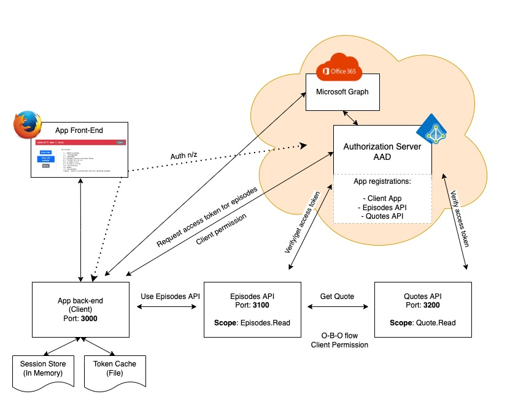

# The Architecture

## Components

This scenario has 3+2 key components. The 3 key components are independent of each-other and can be seen as microservices.

* The Client (front-enc for back-end pattern)
  * Serving the Web front end
  * Handling login/logout, sessions, token cache
  * Managing requests for authentication and authorization (Graph Api, Episodes API)
  * Requesting users InBox from the O365 API
  * Requesting a list of GOT Episodes from the Episodes API
* The Episodes API
  * The protected resource server for Episodes
  * Serve a JSON document with GOT Episodes at /api/episodes
  * Requests needs to be validated, tokens needs to be issued by Azure AD
  * Using O-B-O to request an access token from Azure AD to be used towards the GOT Quotes API
  * Read quotes and include them in episode response to clients
* The Quotes API
  * The protected resource for GOT Quotes
  * Receives and authorize requests (JWT tokens issues by Azure AD)
  * Sends a random GOT Quote back to the Episodes API
* Azure AD
  * The identity provider and the Authority Server
  * We use OIDC and oAuth2 to handle authentication and authorization
* The Microsoft Graph
  * Getting the users inBox.