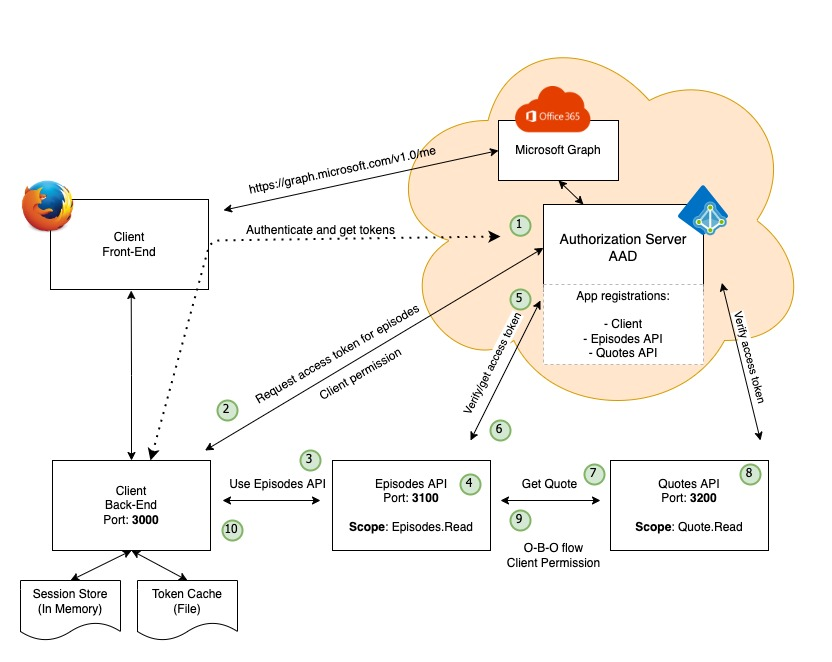

# The Feature

Our system has a limited feature set. We focus on a scenario where the end-user logs in to our application and the request a list of episodes from Game of Thrones (which also will provide a random Game Of Thrones Quote)

## The flow

The general use case flow is as follow:

1. The Client facilitates a login triggered by the end-user, get's Id token and an access token for the O365 graph. (This could involve the end-user giving consent)
2. The Client requests and access token to be used when requesting Episodes
3. The Client uses the access token and request a list of GOT Episodes. Scope is Episodes.Read
4. The Episodes API validates the request and the access token
5. The Episodes API uses the received access token and try to exchange this for a new access token for accessing the Quotes API. This is done on behalf of the user. We use the MS On-Behalf-Of flow
6. The Episodes API gets a separate access token that will be used when requesting a GOT quote
7. The Episodes API requests a GOT Quote from the Quote API. Scope Quote.Read
8. The Quotes API receives and validates the request. If the requests validates and the JWT token is valid, then a random quote is returned
9. The Episodes API receives a quote
10. The Client Receives a list of Got Episodes with a quote at the end.

