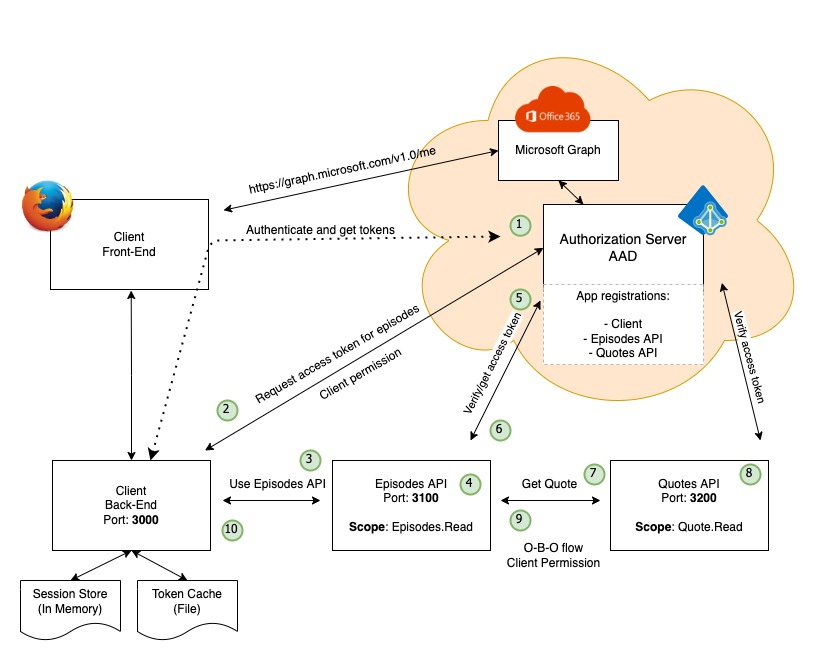

# The Technical Challenges

The Client is the only component that expects some kind of user interaction. We will drive our testing through this component.

### The Client

The client consist of two component, the web front-end and the back-end. A typical integration test would perhaps focus on the back-end. Our current architecture is using the frontend-for-backend pattern - perhaps more secure but also more challenging to test.

* In order to test the client we need to authenticate (and the app should not know it's under test)
  * Automatic authentication will not work with users having MFA on their account
  * We need to use the browser (user agent) when authenticating
    * For the oAuth2 flow
    * For having a sessionId which the back-end uses for authorization
  * Tokens are stored in the back-end, not available on the outside
  * We use AzureAD as the Identity Provider (a key component, a component that we do not control)
* Other challenges?

This represents a challenge on many levels. Some solutions (some more dirty than others) could be:

* <b>Use a [OAuth2 Mock Server](https://github.com/navikt/mock-oauth2-server)</b>
  * This could work but it will need a lot of adaptions since we are using MSAL for NodeJs. MSAL is supporting the standard, but the framework adds a lot of other stuff that would have to be implemented and maintained in the Mock server.
  * Moving away from MSAL NodeJs could make this a valid option. There may be ways to configure MSAL to ignore the MS specific stuff - but's that's not obvious in any documentation.
* <b>Aquire a token from the outside and inject it to the token cache?</b>
  * Sounds dirty but doable until we hit MSAL again. There is so much MSAL-specific happening in the framework with communicating to Azure AD which will bring problems, like SSO. MSAL will also check that the tokens was issued using the correct flow, so throwing tokens around would most likely give problems.
  * We will still have to fake the session store as well and connect this to the token cache. Again - it's not scalable, it's do-able but not really a good idea after all.
  * We would still have to use browser, or at least let our test code handle the "sessionID" cookie required by the back-end
* <b>Turn off authentication?</b>
  * Could be done, but we would break most principles and we would really like to have it turned on.
* <b>Use a different flow to do the initial login/authentication?</b>
  * We would have to introduce code into our app that was used when in "test".
    * We could use a dependency injection pattern or similar to do this.
  * We would still have challenges with accounts with MFA (which is most account)
* Our integration test would also need to handle other components being unresponsive/unavailable (like episodes depending on quotes for the full experience)
* Test everything from the browser, using a driver, trying to do a real login and take it from there.

If we can solve the challenges related to authentication and authorization, perhaps breaking a few principles, we are getting a lot of options for how to test. It's down to this questions:

> Where the best way to spend out test "money"? And don't forget that all automation is code - code that need TLC as long as it's there!
