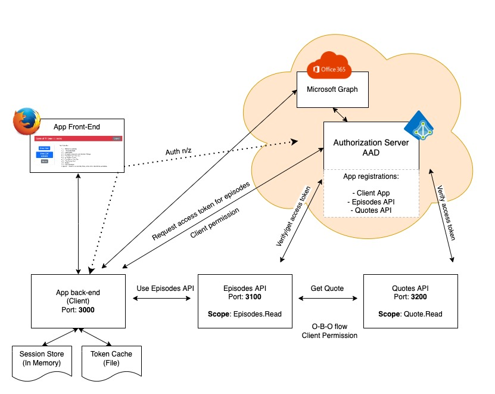

# The PAWA Scenario

Our small scenario is a system with 3 component that we control, a few that we don't control (Azure, the MS Graph), and has a very limited future set.

## Contents

- [The architecture](./doc/the-architecture.md)
- [The feature](./doc/the-feature.md) we focus on.
- [The Testing Challenges](./doc/the-test-challenges.md)
- [Configuring the system](./doc/configuring-the-system.md)
- [Running the system & tests](./doc/running-the-system.md)